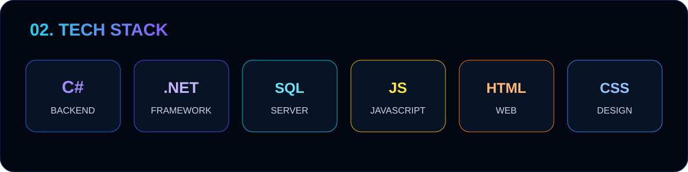
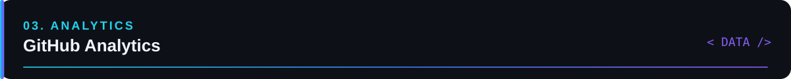
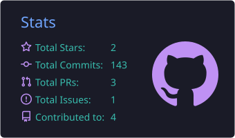
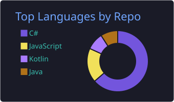
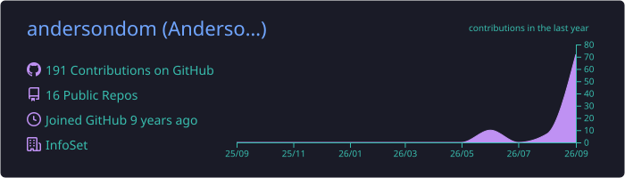
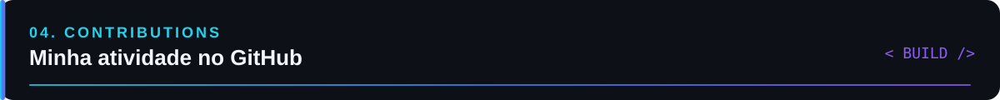
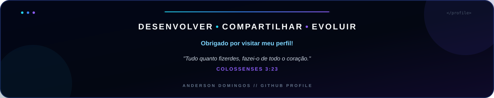

 

&nbsp;&nbsp;

 

<!-- 01 · SOBRE MIM -->

 

<!-- 02 · TECH STACK -->

 

<!-- 03 · GITHUB ANALYTICS -->

<table>
  <tr>
    <td width="50%" align="center">
      
    </td>
    <td width="50%" align="center">
      
    </td>
  </tr>
</table>

 

 

<!-- 04 · CONTRIBUTIONS -->

<picture>
  <source
    media="(prefers-color-scheme: dark)"
    srcset="https://raw.githubusercontent.com/andersondom/andersondom/gh-pages/github-contribution-grid-snake-dark.svg"
  />
  <source
    media="(prefers-color-scheme: light)"
    srcset="https://raw.githubusercontent.com/andersondom/andersondom/gh-pages/github-contribution-grid-snake.svg"
  />
  
</picture>

 

<!-- FOOTER -->

### ⭐ Obrigado por visitar meu perfil!

*"Tudo quanto fizerdes, fazei-o de todo o coração." — Colossenses 3:23*

